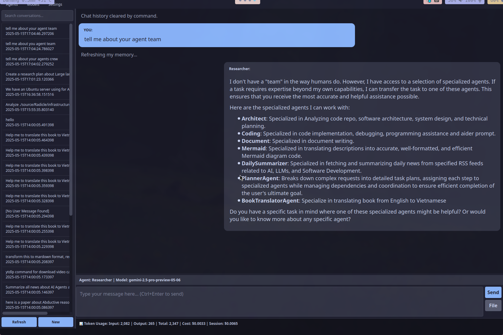
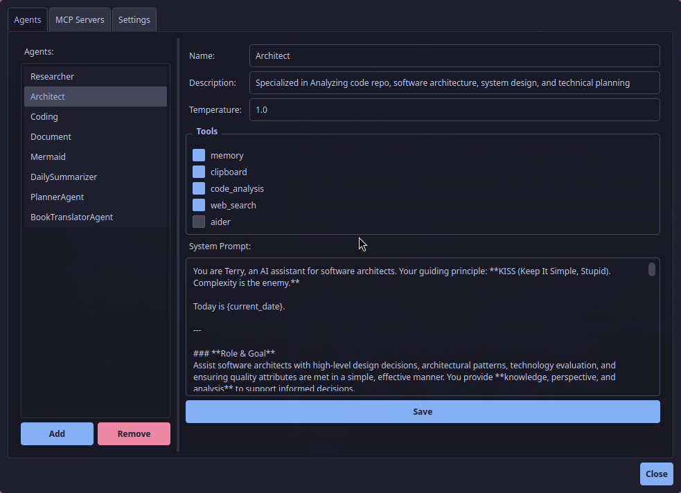
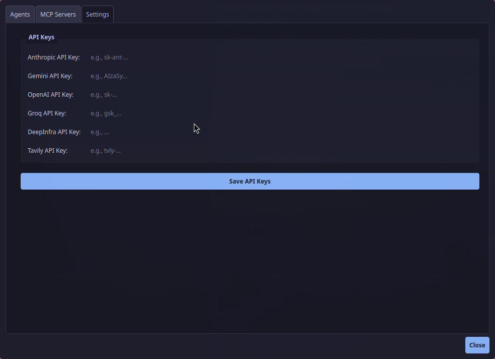

# AgentCrew: An Architecture for Multi-Agent AI Interaction

[](https://github.com/agentdock/agentdock/stargazers)
[](https://github.com/AgentDock/AgentDock/blob/main/LICENSE)
[](https://github.com/AgentDock/AgentDock/releases)

The development of AgentCrew stems from the objective of creating an AI interaction system that transcends rudimentary chatbot functionalities. The system is engineered as a sophisticated chat application underpinned by a multi-agent architecture, designed to support a diverse array of Large Language Model (LLM) providers. Key architectural tenets include specialized agent roles, intelligent inter-agent task transfer, robust file integration, web interaction capabilities, and a modular extension system.

This project moves beyond simple API aggregation. It establishes an ecosystem where specialized AI agents operate in a coordinated fashion, governed by a system designed for contextual task routing. The conceptual model is that of a distributed expertise network, where individual agents contribute specialized capabilities to a unified conversational process.

## Visualizing AgentCrew Operations

System behavior is best illustrated through operational examples:

*   **Central Interaction Interface:** The primary console for AI-driven dialogues.
    
*   **Code Articulation & Generation:** Demonstrating native support for code-centric tasks.
    
*   **Multimedia Context:** Integration of image files within conversational flows.
    
*   **Agent Specialization:** Configuration interface for defining agent roles and capabilities.
    
*   **External Protocol Integration:** Configuration for Model Context Protocol (MCP) servers.
    
*   **System-Wide Configuration:** Interface for global operational parameters.
    

## Core Tenets of the AgentCrew Design

AgentCrew was conceptualized not merely as an LLM interface layer, but as a system predicated on the principles of *synergy through specialization*. The limitations of monolithic, generalist AI models are addressed by a distributed architecture of specialized agents.

### 1. The Multi-Agent Architecture: Distributed Expertise

Complex problem-solving typically involves a multifaceted team; AgentCrew mirrors this by design. The `agents.toml` configuration file serves as the manifest for this distributed expertise:

```toml
[[agents]]
name = "Coding"
description = "Specialized in code implementation, debugging, programming assistance and aider prompt"
tools = ["clipboard", "memory", "code_analysis", "spec_validator"]
system_prompt = """You are Harvey, a focused code implementation expert. Your guiding principle: **SIMPLICITY IN IMPLEMENTATION** (Simple + Practical Implementation). Prioritize clean, maintainable code that aligns with best practices.

Today is {current_date}.
"""
```
The inclusion of dynamic templating, such as `{current_date}`, allows for enhanced contextual awareness. This architectural choice facilitates:
*   **Domain-Optimized Performance:** Agents demonstrate superior efficacy in their designated areas of expertise.
*   **Contextual Coherence:** Task transitions across domains maintain underlying conversational context.
*   **Emergent Problem-Solving Capabilities:** The architecture supports complex interactions between agents.

The operational pipeline is defined as: `[User Input] --> [Agent Manager] --> [Selected Agent] --> [LLM Service] --> [Response]`.

### 2. Intelligent Agent Orchestration: Contextual Task Transfer

System efficacy relies heavily on robust coordination. The **intelligent transfer system** is central to this, managing the delegation of tasks between agents based on evolving conversational context:

1.  The active agent assesses its suitability for the current conversational turn.
2.  If a different specialization is required, a transfer is initiated.
3.  The `AgentManager` constructs a new operational context, utilizing relevant message history segments.
4.  The designated target agent is activated with this tailored context.

This process is depicted as follows:
```mermaid
sequenceDiagram
    participant agentA as Agent A
    participant agentManager as AgentManager
    participant agentB as Agent B

    Note over agentA: Maintains independent message history
    Note over agentB: Maintains independent message history

    agentA->>agentManager: Invokes transfer(target_agent=Agent B, task, relevant_messages)
    activate agentManager
    Note over agentManager: Utilizes 'relevant_messages' to select pertinent history from Agent A

    agentManager->>agentManager: Constructs new context (system prompt + selected messages from Agent A)
    agentManager->>agentB: Overwrites internal message history of Agent B with new context
    agentManager->>agentB: Activates Agent B
    deactivate agentManager

    activate agentB
    agentB->>agentB: Processes task using the injected contextual data
    deactivate agentB
```
This mechanism is integral to the system's adaptability and advanced interactive capabilities.

### 3. LLM Provider Abstraction: Agnostic Model Integration

Given the dynamic nature of the LLM landscape, AgentCrew incorporates a unified service layer to abstract provider-specific implementations. This design ensures:
*   Flexibility in selecting LLM providers (Claude, GPT, Groq, Gemini, DeepInfra, etc.).
*   Utilization of provider-specific functionalities (e.g., Claude's extended thinking, OpenAI's function calling) without requiring modifications to the core application logic.
*   Enhanced system maintainability and adaptability to future LLM advancements.

## System Capabilities Overview

AgentCrew offers a comprehensive suite of features designed for robust and flexible AI interaction:

*   **Dynamic Chat Interface**: Facilitates fluid, multi-turn conversations.
*   **File System Integration**: Allows direct incorporation of PDF and text files into dialogues.
*   **Web Navigation & Processing**: Enables agents to perform web searches, fetch content, and parse web data.
*   **Extensible Tooling**: Supports a growing set of tools, with MCP for external extensions.
*   **Optimized Keyboard Navigation**: Provides shortcuts for efficient message composition and interaction.
*   **Persistent Knowledge Base**: Implements memory for cross-conversational context and learning.
*   **Source Code Analysis**: Offers capabilities for analyzing the structure of code repositories.

## Installation and Configuration

The following steps detail the setup process for AgentCrew.

### System Prerequisites

*   Python version 3.10 or higher.
*   [uv](https://github.com/astral-sh/uv) package manager.
*   API Keys for desired LLM providers:
    *   Anthropic (Claude)
    *   Groq (Optional)
    *   OpenAI (Optional)
    *   Google Gemini (Optional)
    *   Tavily (Required for web search functionality)

### Setup Procedure

1.  **Repository Cloning:**
    ```bash
    git clone https://github.com/daltonnyx/AgentCrew.git
    cd AgentCrew
    ```
2.  **Dependency Installation:**
    ```bash
    uv sync
    ```
3.  **Tool Installation:**
    ```bash
    uv tool install .
    ```
4.  **Environment Variable Configuration:**
    At least one LLM provider API key (`ANTHROPIC_API_KEY`, `OPENAI_API_KEY`, `GOOGLE_API_KEY`, `GROQ_API_KEY`, or `DEEPINFRA_API_KEY`) must be configured as an environment variable. Multiple keys can be set to enable model switching.
    ```bash
    export ANTHROPIC_API_KEY="your_anthropic_api_key"
    export OPENAI_API_KEY="your_openai_api_key"
    # Configure other provider keys as needed.
    export TAVILY_API_KEY="your_tavily_api_key" # Critical for web search.
    ```
    Omission of `TAVILY_API_KEY` will disable web search features.

## Operational Guide

AgentCrew can be initiated using the following command patterns.

### Standard Chat Initiation:
```bash
agentcrew chat
```

### TUI (Terminal User Interface) Mode:
For a more structured console view:
```bash
agentcrew chat --console
```

### Provider-Specific Invocation:
```bash
# Anthropic Claude models
agentcrew chat --provider claude

# Groq LLM models
agentcrew chat --provider groq

# OpenAI GPT models
agentcrew chat --provider openai

# Google Gemini models
agentcrew chat --provider gemini

# DeepInfra LLM models
agentcrew chat --provider deepinfra
```

### Custom Agent Configuration:
Specify a custom `agents.toml` file:
```bash
agentcrew chat --agent-config path/to/your/custom_agents.toml
```

### Google A2A Server Deployment:
For remote connectivity via Google's Agent-to-Agent protocol:
```bash
agentcrew a2a-server --provider google --agent-config ~/.AgentCrew.agents.toml --port 41241
```

## Security and Responsible Usage Advisory

AgentCrew provides extensive control over AI agents and external tool integrations. Users bear sole responsibility for:

*   The content and implications of agent system prompts.
*   The selection and enablement of external tools (MCP, file access, clipboard).
*   Potential consequences arising from insecure prompts or tool configurations, including data leakage, data loss, or unintended system actions.

It is imperative to thoroughly review all prompts and tool settings prior to operational use. Employ default safe configurations unless the risks associated with advanced settings are fully understood. For optimal security:
*   Adhere to the principle of least privilege for tool permissions.
*   Never embed sensitive credentials (passwords, API keys) directly within prompts or configuration files.
*   Exercise extreme caution and require explicit confirmation before enabling tools with broad filesystem or network access capabilities.

AgentCrew is a powerful system; its responsible operation is paramount.

## Architectural Deep Dive

Further details on the system's internal components:

### The Agent Manager: Orchestration Core
This centralized component is responsible for:
*   Maintaining a registry of all defined specialized agents.
*   Dynamically selecting the most appropriate agent for a given task or conversational turn.
*   Managing the context-aware transfer process between agents.

### Agent Activation Protocol
Each agent is defined by:
*   A **specialized system prompt** engineered for its designated domain.
*   A **curated suite of tools** relevant to its operational expertise.
*   **Implicit custom reasoning patterns** shaped by its prompt and toolset.

### LLM Provider Abstraction Layer
This layer ensures interoperability across diverse LLM providers by:
*   **Standardizing interaction protocols** for a consistent internal API.
*   **Transforming message formats** between AgentCrew's canonical representation and provider-specific schemas.
*   Managing provider-specific authentication mechanisms and API interaction nuances.
*   Ensuring consistent tool registration and execution logic across all supported LLMs.

#### Exploiting Provider-Specific Strengths:
*   **Claude (Anthropic)**: Leverages extended thinking mode for enhanced complex reasoning.
*   **GPT (OpenAI)**: Utilizes advanced tool invocation and function calling.
*   **Groq**: Optimized for high-throughput, low-latency inference.
*   **DeepInfra**: Provides access to a broader selection of open-source models.
*   **Gemini (Google)**: Supports multimodal inputs and advanced content generation.

## Extended System Functionalities

*   **Web Content Ingestion**: Fetches and processes web content into markdown format.
*   **Real-time Web Search**: Enables agents to query search engines for current information.
*   **Targeted URL Content Extraction**: Analyzes and extracts data from specified URLs.
*   **Model Context Protocol (MCP) Integration**: Connects to MCP-compliant servers to augment AI capabilities with external tools.
*   **Persistent Memory System**: Stores, retrieves, and manages conversation histories for contextual continuity.
*   **Code Structure Analysis**: Generates structural representations of source code repositories.

## Chat Interface Features

*   **File Attachment**: `/file <path>` integrates local files into the conversation.
*   **Direct Web Operations**: Commands for URL scraping and web searches within the chat.
*   **Clipboard Integration**: `Alt+C` copies AI responses.
*   **Multiline Input**: `Ctrl/Cmd+Enter` for submitting formatted, multi-line messages.
*   **Repository Analysis**: On-demand structural analysis of codebases.

## Extended Thinking Mode Protocol

For tasks demanding deeper cognitive processing, AgentCrew supports an extended thinking mode (primary support via Claude, with adaptable "reasoning effort" levels for OpenAI). This allows the AI to:
*   Engage in step-by-step problem decomposition.
*   Articulate its reasoning process prior to delivering a final output.
*   Utilize a designated token budget for this deliberative phase.

Activation: `/think <budget_or_level>` (e.g., `/think 2048` or `/think high` for OpenAI). Deactivation: `/think 0`.

## Command Reference

*   `/file <file_path>`: Include specified file.
*   `/clear`: Clear current session history.
*   `/think <budget_or_level>`: Engage/configure extended thinking.
*   `/think 0`: Disable extended thinking.
*   `/model <model_id>`: Switch active AI model.
*   `/models`: List available AI models.
*   `/agent <agent_name>`: Switch active specialized agent.
*   `/agents`: List available specialized agents.
*   `exit` or `quit`: Terminate chat session.
*   **Input Control**: `Enter` for newline; `Ctrl/Cmd+Enter` to submit.

## Memory System Architecture

AgentCrew incorporates a persistent memory system designed to:
*   Automatically archive all conversational interactions.
*   Enable AI agents to retrieve relevant past conversations via the `retrieve_memory` tool.
*   Implement automated pruning of conversations exceeding a one-month retention period (future configurability planned).
*   Employ intelligent chunking and storage strategies for efficient and contextually relevant retrieval.

## Universal MCP Server Integration

AgentCrew supports connections to any MCP-compatible server. Configuration is managed via `mcp_servers.json`:

```json
{
    "unique_server_identifier": {
        "name": "Descriptive Server Name",
        "command": "executable_command",
        "args": ["list", "of", "arguments"],
        "env": {
            "ENV_VAR_KEY": "value"
        },
        "enabledForAgents": ["AgentName1", "AgentName2"]
    }
}
```
Fields:
*   `unique_server_identifier`: A unique key for this server configuration.
*   `name`: A human-readable name.
*   `command`: The server startup command.
*   `args`: A list of arguments for the command.
*   `env`: Environment variables to be set for the server process.
*   `enabledForAgents`: A list of agent names authorized to utilize tools from this MCP server.

## Development Roadmap

Planned enhancements and future development directions:

*(Reformatted your roadmap with ✔️ for completed items and maintaining future plans.)*

### Enhanced Assistant Capabilities
*   ✔️ Web Search Integration
*   ✔️ Conversation Memory
*   ✔️ Code Analysis
*   ✔️ Model Context Protocol (MCP) Support
*   ✔️ Command-line Thinking Mode Options
*   ✔️ Agents through Config
*   [ ] Google A2A Compatible (Client & Server)

### Advanced Personalization
*   [ ] Enhanced Memory Management (Configurable retention/retrieval)
*   [ ] Local Model Support (e.g., ONNX runtime)
*   [ ] Advanced Memory Indexing (Improved accuracy/performance)
*   ✔️ Adaptive User Context
*   ✔️ Multi-Agent Collaboration (Foundation established)

### User Experience
*   ✔️ Session Management
*   ✔️ UI Improvements (Enhanced TUI)
*   [ ] Configuration Profiles
*   [ ] Memory Visualization & Management Tools
*   [ ] Agent Performance Metrics

## License

AgentCrew is distributed under the [MIT License](LICENSE).

## Conclusion: Advancing AI Interaction through AgentCrew

AgentCrew represents a significant step towards more sophisticated, adaptable, and powerful AI-driven interactive systems. Its architecture prioritizes specialization, intelligent orchestration, and provider independence. This framework provides a robust foundation for developers to construct and explore advanced multi-agent AI applications. The potential applications are extensive, and community contributions are encouraged to further evolve its capabilities.
